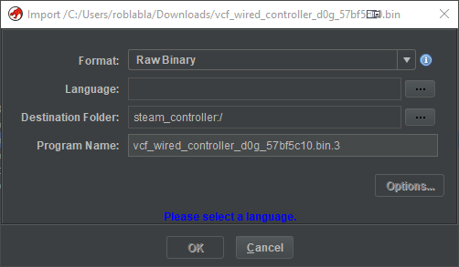

# Ghidra binary loading tutorial

This tutorial will show you how to load a new LPC11 Steam Controller firmware
into Ghidra for reverse engineering purposes. Note that this is mostly
unnecessary if opening a pre-loaded GZF, as those will already be properly
loaded.

## Loading the binary

First, you should split the binary into two components. Every Steam Controller
firmware is split in two parts: the bootloader spans the first 0x2000 bytes,
whilst the firmware takes the rest of the file. It is heavily recommended to
only load one or the other into Ghidra - loading both at the same time will lead
Ghidra to struggle on "shared" global variables between the two programs.

For the purpose of following this tutorial, I highly recommend using the
bootloader, as it's what I used, and loading a firmware requires some complex
memory layout mangling to trick ghidra into being happy.

To load a binary into Ghidra, you first want to create a new project (which may
contain many different files for reverse engineering). You will then want to
import your firmware binary using File -> Import File. Ghidra will open an
import window.

You will want to set the "Language" to "ARM:LE:32:Cortex:default". This tells
Ghidra to treat the file as an ARM Little Endian binary that targets Cortex-M
devices, and force it to create a vector table at the start of the firmware.

If loading a firmware and not a bootloader, go in the options and make sure to
set the "Base Address" to 0x2000.

Once imported, the file will appear in the project. Double click it to open it
in the CodeBrowser, the main Ghidra window. Ghidra will ask to auto-analyse the
project, say yes. Ghidra will spend a little while trying to find code. You can
see its progress in the bottom right corner. Once it is done (shouldn't take
more than a minute), you will start seeing functions showing up in the
"Functions" tab on the left. We can now start decompiling some code. We can
double click on the address under "Reset" to have the asm view travel there.

# Setting the Memory Layout

To help Ghidra give us good decompilation output, we need to make it aware of
the memory layout of our binary and the device it runs on. Right now, Ghidra
simply assumes that there is a single region of memory spanning the binary in
RWX mode, and nothing else is mapped.

The first thing we'll want to do is set the binary to be in RX. We know that the
binary is not directly writable - flash memory tends to need rather complex MMIO
sequences to be written to. To do so, click on the Memory Map button  and untick the
"w" on the row named "RAM". While we're at it, we can rename that row to "ROM".

If working with a firmware, you'll want to create a new section named
"VECTOR_TABLE" at address 0, of size 0xc0, and with the "File Bytes" option
checked. This will duplicate the first 0xc0 bytes of our firmware image (which
contains the vector table) at address 0.

Next, we can look at the LPC11UXX user guide to find where the RAM region is.
The datasheet tells us that there exists three different RAM regions:

- SRAM0, from 0x10000000, 0x2000 bytes
- SRAM1, from 0x20000000, 0x2000 bytes
- USB_RAM, from 0x20004000, 0x800 bytes

Click on the green plus button to add a new memory region. They should be RW,
and left uninitialized for now.

Once all three areas are mapped, press the save button in the memory layout and
exit it. The next step is to add the MMIO regions. We'll use a fixed version of
the [Ghidra SVD Loader] in order to load SVD definitions for our CPU into
ghidra. `SVD` is an XML file format standardized by ARM to define the MMIO
regions of a CPU, among others. Ghidra SVD Loader will use those files to create
the memory regions and structures necessary to guide the decompiler towards
producing good output for code interacting with those.

Install the Ghidra SVD Loader by cloning the git repo, going to Ghidra's Script
Manager () and adding
its directory to Ghidra's Script Directories (). Next, we'll download the SVD definitions for our CPU. We'll
want the [LPC11Uxx_v7.svd] file and the [cm0.svd] file. Once downloaded, look
for SVD-Loader in the script manager, and click the "Run Script" button. It will
ask for a file. We'll first give it the LPC11Uxx_v7.svd file. Once it's done,
run it again, this time providing the CM0.svd file.

With all this done, we now have a fully imported binary!

[Ghidra SVD Loader]: https://github.com/roblabla/SVD-Loader-Ghidra/
[LPC11Uxx_v7.svd]: https://github.com/posborne/cmsis-svd/blob/master/data/NXP/LPC11Uxx_v7.svd
[cm0.svd]: https://github.com/AdaCore/svd2ada/blob/master/CMSIS-SVD/Cortex_M/cm0.svd

# Reverse engineering the CRT

The first thing to reverse engineer will be the CRT init functions - those are
the first couple of functions in the binary, responsible for clearing the BSS,
copying the .data RW segment into RAM, and doing some fancy things like
decompression.

The Reset function should be calling either one or two functions: The first one,
only present in the bootloader, does some minimal hardware setup, and isn't very
interesting. The second one is the crt0 init function. You should have a
decompilation output looking roughly like this: 

We can see Ghidra is calling function pointers stored in a global. This is the
`crt_init`. We'll create a structure in Ghidra to represent those functions. In
the "Data Type Manager" view (bottom left of the CodeBrowser window), right
click on your project name (here vcf_wired_controller_d0g_57bf5c10) and chose
New -> Structure. You will be presented with a structure editor window. First,
fill out the structure name with "ctor_initializer". Then, fill up the table
to create four fields, such that the editor looks like this:

Save the structure and close the Structure Editor. We can now set the type of
our initializer. Right click the global (`UNK_00000183c`) and chose "Retype
Global". We'll set its type to `ctor_initializer[1]`. If ghidra complains that
there is not enough space, double click on the global, clear any already typed
globals there (select them and press the `C` key), then try again. You can also
rename the global by placing your cursor on top of it and press the `L` key.

Looking at the while loop, we see that the code will repeatedly call the
initializer on every member of the array. We can easily figure out that there
are two elements to the initializer array, so we can set its type to
`ctor_initializer[2]`. If we double click our CTOR_ARR and expand all of its
field, we should now see something like this:

Now that we have our initializer, the next step is to figure out where they are
and what they do. The first step is to click on both initializer labels and turn
them into functions, and give the parameter names. It'll become pretty obvious
pretty fast that the first initializer is copying the flash into the RAM, while
the second initializer is setting the RAM to 0 without reading the flash. From
this, we can deduce that the first part is the .data, while the second is our
.bss.

Let's encode this knowledge into the memory layout into our binary! Reopen the
memory layout  and split
the SRAM0 block using the Split Block icon (), such that you now have four blocks: SRAM0.start, SRAM0.data,
SRAM0.bss and SRAM0.end. Then, delete the SRAM0.data - we'll recreate it such
that it is initialized with the data. Create a new block, named SRAM0.data and
spanning the same byte range. But this time, tick the "File Bytes" checkmark,
and fill "File Offset" with the value in `start_flash` of your bss segment
(0x185c in the example).

The final sram layout should like like this: 

Note that the firmware binary has more complicated initializer that decompresses
the data. To get those initialized in Ghidra, the easiest way is to use Ghidra's
emulation features - a separate tutorial to do this would be in order however.

# Tips and Tricks

The firmware is written using the open source LPCOpen framework. Almost all code
that interacts with MMIO registers is actually a function from this framework,
as such it is generally a good idea to look for an equivalent function there
when naming the functions or trying to figure out the arguments.

When finding a function that doesn't ever return (for instance, a function doing
an infinite loop), make sure you edit the function and set it as noreturn! This
will prevent Ghidra from "merging" together unrelated functions that come after
a call to a noreturn function!
